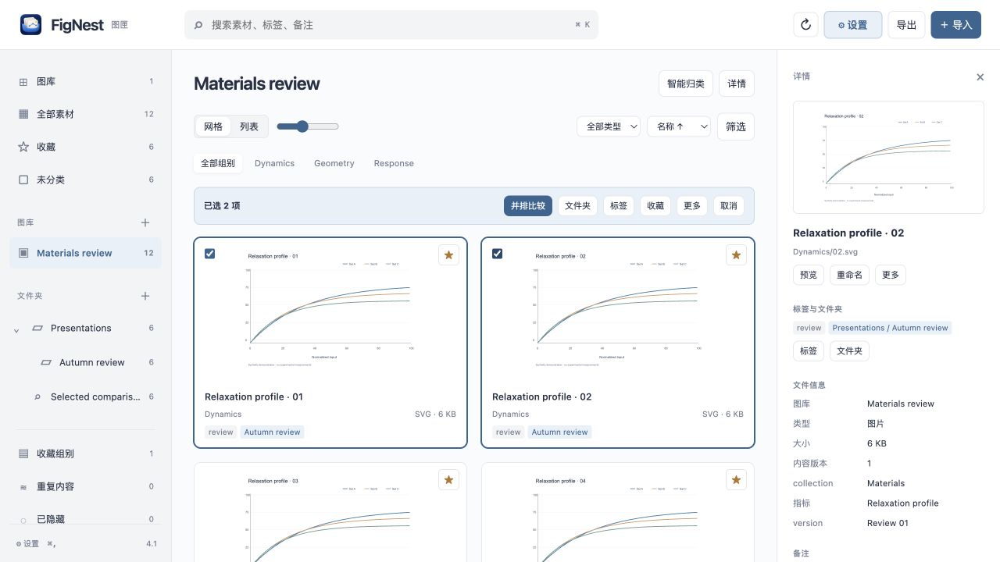
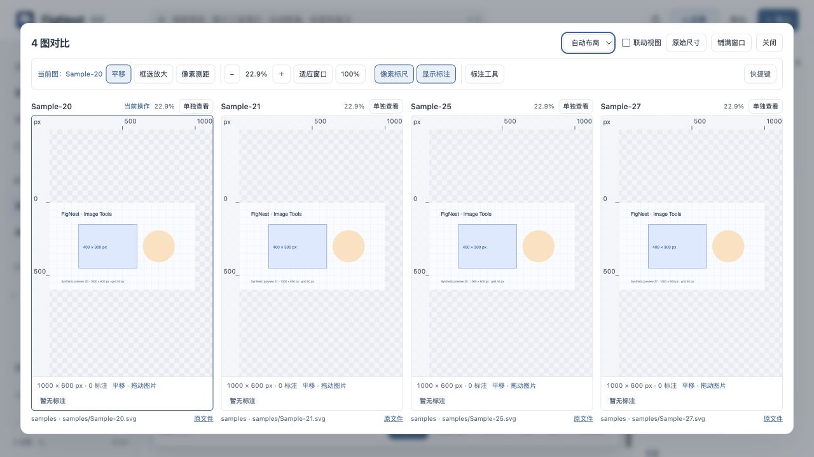
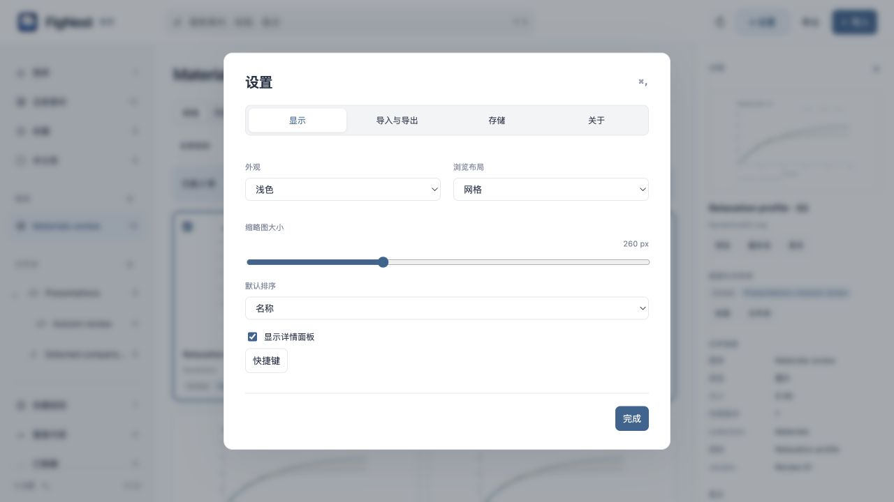

<a id="english"></a>

# FigNest


[](#english)
[](#中文)

[](https://github.com/QiushanHuang/FigNest/releases)
[](https://github.com/QiushanHuang/FigNest/actions/workflows/ci.yml)
[](https://github.com/QiushanHuang/FigNest/releases)
[](#your-files-and-your-library)

**Organize, inspect, annotate, and share figures—with their context.**

A folder can tell you where a picture lives. It rarely tells you why you saved it,
which version matters, or what you wanted to compare it with.
FigNest turns those scattered images into a working library: collect them,
keep notes beside them, compare across projects, and take a self-contained HTML
gallery into your next meeting.

## Why choose FigNest?

**For people who use images to think, compare, and explain—not just to store them.**
Its focus is the whole path from a directory of figures to a curated, annotated
comparison you can reopen or share.

| Friction in a familiar workflow | What FigNest changes | What you gain |
| --- | --- | --- |
| One figure belongs in several experiments, reports, or reference sets. Copying it into each folder creates more files to maintain. | Put one library item in multiple virtual folders; keep the source where it is. | Different ways to organize the same material, without rearranging project directories. |
| Comparing versions means switching windows and trying to remember which image was which. | Select across libraries and compare 2–4 images side by side. Keep notes and metadata alongside them. | Less window switching, more attention on the differences. |
| Useful selections disappear into filenames, screenshots, or browser bookmarks. | Save favorites, tags, notes, attachments, and rule-based smart folders in a local database. | A collection that keeps its context when you come back. |
| Sharing a folder leaves someone else to install a viewer and reconstruct the intended grouping. | Export a self-contained HTML gallery with embedded images and saved annotations. | A portable view they can open offline in a browser. |
| New results arrive repeatedly, and sorting/exporting starts from scratch each time. | Reuse import rules, directory hierarchy, tags, and optional automatic HTML export. | A repeatable workflow that retains your previous curation. |

### Useful in the moments that matter

- **Research and engineering reviews:** compare result plots across models or runs, keep parameter labels visible, and collect the figures for a presentation without moving raw project files.
- **Design iterations:** review alternatives, keep reference files and feedback together, and maintain a shortlist across separate projects.
- **Teaching and technical documentation:** organize illustrations by topic, attach source notes, and prepare an offline gallery for a lesson or meeting.

### A quick tour

| Need to… | Start with… |
| --- | --- |
| Collect a directory of figures | **Import** → choose files or a folder; enable **Keep folder hierarchy** if useful |
| Build a presentation shortlist | Select items → **Folder** or **Favorite** |
| Keep a view up to date | Create a smart folder using keywords, tags, type, or metadata |
| Compare across projects | Select 2–4 images, then right-click → **并排比较 / Compare**, or use the persistent selection bar |
| Inspect or annotate details | Open a preview → box zoom, pixel ruler, reference lines and annotation tools |
| Preview or return to the source | Click the title to preview; use **More / right-click → Show in Finder** to locate the source or retained copy |
| Share a prepared collection | **Export** → select a library/folder → generate a new HTML snapshot |
| Set up your workspace | **Settings** in the toolbar, or **⌘,** in the Mac app |



*Screenshots use synthetic demonstration figures. The current interface uses Chinese labels; this guide covers the workflow in English and Chinese.*

## New in 4.3: fewer steps from finding to inspecting

Search shows its current scope and active filters. Remove a filter chip, clear all
filters, or search all assets with the same keywords when a result is empty.
Selections stay available in the bottom action bar as you scroll; **View selected**
shows items from every scope, and returns you to your previous view. The folder
picker supports search and shows when only some selected items belong to a folder.

Open an image by its title, preview button, double-click, or Enter/Space. In a
comparison, click the image you want to work on: a blue outline and current-image
label identify the target. Choose automatic, one-row or two-column layout (two columns for 3–4 images);
optionally link zoom and pan by relative image position. **View alone** and
**Return to comparison** preserve the selected group and layout.



### Inspect first, annotate when needed

Pan, box zoom, pixel distance, fit, 100%, rulers and annotation visibility remain
available when the annotation panel is collapsed. Open **标注工具 / Annotation tools**
for text, arrows, lines, rectangles, ellipses, freehand strokes, and horizontal or
vertical reference lines. Drawing shortcuts expand the panel automatically.
Choose whether it opens by default in the panel or **Settings → Display**.

**Clear annotations** removes all marks on the current image in one action and
can be undone. Save explicitly with **Save annotations / ⌘S** (Ctrl+S in the
browser); comparison also offers **Save all**. The save state stays visible while
you move or zoom. Unsaved edits are guarded on closing, navigation and native
quit/reload. Save conflicts retain your edits and show an error.

Export the marked image as PNG or its editable annotation data as JSON. New
offline HTML snapshots include saved marks for viewing. Measurements use the
decoded image's original pixel coordinates; they do not calibrate physical units.
Annotations are stored separately and do not rewrite source images.

## Install

Download **FigNest v4.3.0 for macOS Apple Silicon** from
[Releases](https://github.com/QiushanHuang/FigNest/releases/latest).

1. On macOS 27+ with Apple Silicon, open the DMG and drag **图匣.app** into Applications. A ZIP is also available.
2. Open FigNest and import your first library. The packaged app includes its runtime; no Python installation is needed.
3. Use **FigNest → Settings…** or **⌘,** to set the appearance, layout, import rules, and export behavior.

The package is locally ad-hoc signed and **not Apple-notarized**. If macOS asks
for approval on first launch, verify that you downloaded it from this repository,
then follow Apple's [opening an app from an unidentified developer](https://support.apple.com/guide/mac-help/open-a-mac-app-from-an-unknown-developer-mh40616/mac) instructions.

To update, save image annotations, finish imports/exports and close the live viewers, then stop this
library's background service before replacing the app:

```sh
"/Applications/图匣.app/Contents/Resources/backend/library-backend" stop
```

Adjust the app path if you installed it elsewhere. Your library lives separately
from the application. Keep the old app until the new version opens successfully.

### Lightweight browser edition

The live browser interface and Mac app use the same local database. From the
[source package](https://github.com/QiushanHuang/FigNest/releases/latest), with Python 3.10+:

```sh
python3 scripts/library.py launch
```

This opens a loopback-only local service. A separately exported HTML is a portable,
read-only snapshot and opens without Python or the service. Use the live app/browser
when you want to change library organization.

The optional **Skill ZIP** contains the reusable `image-collection-viewer` folder.
Place it in your assistant's configured skills directory, or give the assistant
the included `SKILL.md` together with the file locations you want organized.
It reuses this viewer and its import rules instead of rebuilding a gallery each time.

## Make the workflow yours

### Folders, tags, and smart folders

Use libraries to separate collections, nested folders to curate sets, and tags to
describe material across folders. Smart folders are saved conditions: newly imported
matching items appear automatically. Drag items onto a folder to add them; drag a
folder onto another to change its parent.

Select as many items as needed for batch organization. Comparison is a separate
action for 2–4 images. Grid/list view, thumbnail size, sorting, and the inspector
let you choose between browsing many figures and inspecting one closely.

### Notes, ordinary files, and exports

Keep CSV, PDF, Markdown, archives, or other files in the library alongside images.
Supported images preview directly; other formats use file cards with the original
available for download or Finder access. Add any file as an image/group note attachment.

Export a whole library, a folder subtree, or a smart-folder result. Each export is a
new independent HTML file. It embeds the selected image/general-file bytes and saved
annotations; note attachments are listed by name and remain accessible from the live library.

### Repeatable import

```sh
# Create an image library; use --all-files to include ordinary files.
python3 scripts/library.py import --input /path/to/figures --name "Project A"

# Refresh the same library, retaining favorites, notes and display names.
python3 scripts/library.py refresh --library-id YOUR_LIBRARY_ID

# Publish another offline snapshot.
python3 scripts/library.py export --library-id YOUR_LIBRARY_ID
```

For repeat imports, retain the returned library ID. Configure metadata rules with
`--config`, or import presets with `--options`. See the [workflow and API guide](docs/automation.md).

## Keyboard and settings

| Action | Shortcut |
| --- | --- |
| Settings | **⌘,** |
| Search | ⌘K / ⌘F |
| Select all filtered items | ⌘A |
| Select a continuous range | Shift + select |
| Browse / preview | Arrow keys, Home/End; Enter/Space, title click or double-click |
| Pan / box zoom / pixel distance | V / Z / R; hold Space to pan temporarily |
| Save image annotations | ⌘S / Ctrl+S, including while typing annotation text |
| Undo / redo marks | ⌘Z / ⌘⇧Z (Ctrl equivalents in the browser) |
| Compare selected images | ⌘Enter |
| Move selected items to recovery | ⌘Backspace |
| Close preview / clear selection | Escape |



Changes to display preferences and import rules are saved to the database. The
Mac menu's **About FigNest** shows the installed version, build and copyright.

## Your files and your library

The default data folder is `~/Pictures/ImageCollectionViewer`. FigNest retains
managed copies, so a library can still display an item when its source is unavailable.
Favorites, notes, custom names, folders and preferences are stored in SQLite.

Use **Settings → Storage** to open that folder or back up the database. Copy the
**whole data folder** for a complete backup including file bytes and exports.
Moving an item to the recovery area is reversible. Permanent removal clears
FigNest's records and unused managed copies; original source files and independent
HTML exports remain in their own locations.

| Current import limits | Size |
| --- | --- |
| Main-library browser import | 20 MiB per file; 256 MiB / 5,000 items per batch |
| CLI directory import | 256 MiB / 5,000 items per batch |
| Note attachment | 2 GiB per file, chunked transfer |

## Guides and development

[User guide / 使用指南](docs/USER_GUIDE.md) · [Automation](docs/automation.md) ·
[Release notes](docs/releases/v4.3.0.md) · [Changelog](CHANGELOG.md)

```sh
python3 -m unittest discover -s tests -p 'test_*.py'
node tests/test_workspace.js
node tests/test_image_tools.js
node tests/test_ux.js
node tests/test_settings.js
node tests/test_drop.js
```

For a Mac build, install Xcode Command Line Tools and a compatible PyInstaller:

```sh
python3 -m pip install pyinstaller
python3 native/build_app.py --output dist/图匣.app
```

The current binary package requires macOS 27+; the source browser edition needs Python 3.10+.
The native wrapper targets macOS 13+, but a source build also inherits its bundled
Python and library requirements. The builder records the highest required OS version. See [contributing](CONTRIBUTING.md)
for the source layout and validation checklist.

Created and maintained by [**Qiushan** · **@QiushanHuang**](https://github.com/QiushanHuang).
See [contributors](CONTRIBUTORS.md) and [third-party notices](THIRD_PARTY_NOTICES.md).

---

<a id="中文"></a>

## 中文


[](#english)
[](#中文)

**整理、细看、标注，带着上下文分享图片。**

文件夹能告诉你图片放在哪里，却很难留下“为什么保存它、哪个版本重要、准备和哪张图比较”。
FigNest 把分散的图片整理成可以持续使用的图库：收集素材、保留说明、跨项目对照，
再把挑好的内容导出成一个离线 HTML，带到下一次讨论或汇报中。

### 为什么选 FigNest？

**如果你经常用图片思考、比较和说明问题，而不只是保存照片，FigNest 就是为这类工作准备的。**
它把“目录里的图 → 有上下文的整理 → 对照查看 → 分享展示”连成一条工作流程。

| 常见工作方式的麻烦 | FigNest 的做法 | 直接收益 |
| --- | --- | --- |
| 一张图同时属于多个实验、报告和参考集，复制到不同目录后越来越难维护。 | 同一素材可归入多个虚拟文件夹，原始项目目录保持原样。 | 按不同目的整理，不用反复搬图、复制文件。 |
| 对比版本要切换多个窗口，还得记住各自对应什么。 | 跨图库选择，2–4 张图并排查看，旁边保留参数和备注。 | 少切窗口，把注意力放在差异上。 |
| 选图理由散落在文件名、截图和浏览器书签里，过几天就忘了。 | 收藏、标签、备注、附件和智能文件夹都存进本机数据库。 | 下次打开时，图片和当时的判断仍在一起。 |
| 发一个图片文件夹给别人，对方还要安装工具、重新理解分组。 | 导出内嵌图片与备注的独立 HTML。 | 用浏览器离线打开，直接进入准备好的内容。 |
| 新结果不断产生，每次又从分类、打标签和导出重新开始。 | 复用导入规则，保留目录层级，自动加标签并按需导出。 | 把重复整理变成固定流程，已有备注和收藏继续保留。 |

#### 什么时候特别有用？

- **科研与工程汇报**：比较不同模型、批次和版本的图，查看参数，挑选汇报素材，不改动原始项目目录。
- **设计迭代与参考收集**：并排看方案，把参考文件和反馈留在一起，跨项目维护重点素材。
- **教学与技术文档**：按主题整理插图，附上来源说明，为课堂或讨论准备离线图库。

#### 半分钟了解主要操作

| 你想做什么 | 从这里开始 |
| --- | --- |
| 把一个目录收进来 | **导入** → 选择文件或文件夹，可勾选“保留目录层级” |
| 挑出汇报重点 | 多选 → **文件夹**或**收藏** |
| 让一组内容自动更新 | 用关键词、标签、类型和参数创建智能文件夹 |
| 跨项目比较 | 选择 2–4 张图，通过**右键 → 并排比较**或底部常驻选择栏进入 |
| 细看和标注 | 打开预览，使用框选放大、像素标尺、参考线和标注工具 |
| 预览或回到原文件 | 点击标题预览；通过**更多 / 右键 → 在 Finder 中显示**定位源文件或图库副本 |
| 分享整理好的内容 | **导出** → 选择图库或文件夹 → 生成新的 HTML 快照 |
| 调整常用选项 | 右上角**设置**，或 Mac 应用中的 **⌘,** |


*截图使用独立制作的演示图，不包含真实研究数据。*

### 4.3 新功能：从找图到细看，减少重复操作

搜索会显示当前范围和已启用的筛选条件。可以移除单个筛选、清除全部条件，
无结果时保留关键词改为搜索全部素材。底部选择栏在滚动时常驻，**查看已选**
集中显示不同范围的选择，返回后恢复原来的页面。文件夹选择支持搜索，并显示部分成员状态。

点击标题、预览按钮、双击或 Enter / 空格即可看图。比较时点击要操作的图片，
蓝色边框与“当前图”明确显示目标。可选自动、一行、两列布局（两列适用于 3–4 张图），按需开启相对缩放和平移联动；
**单独查看 → 返回比较**保留同一组图片和布局。


#### 观察工具常驻，标注按需展开

平移、框选放大、像素测距、适应窗口、100%、像素标尺和显示标注保持常驻。
展开**标注工具**后，可以添加文字、箭头、直线、矩形、椭圆、画笔和水平/垂直参考线。
绘制快捷键会自动展开面板；在面板或**设置 → 显示**中可选择是否默认展开。

**清除标注**一键清空当前图片的标记，支持撤销。点击**保存标注**或按 **⌘S**
（浏览器为 Ctrl+S）明确保存，比较界面也支持**保存全部**。
移动图片和缩放不会覆盖保存状态；关闭、切换图片、原生退出/重新载入前会保护未保存修改。
遇到保存冲突时保留编辑内容并显示错误。

可导出带标注的 PNG 或可编辑的标注 JSON，新导出的离线 HTML 会显示已保存的标注。
测量基于解码图片的原始像素坐标，不做物理单位标定。标注单独保存，不改写原始图片。

### 安装

从 [Releases](https://github.com/QiushanHuang/FigNest/releases/latest) 下载
**FigNest v4.3.0 · macOS Apple Silicon**。

1. 在 macOS 27+ 的 Apple Silicon Mac 上打开 DMG，将 **图匣.app** 拖入 Applications，也可以下载 ZIP。
2. 打开 FigNest，导入第一个图库。安装包自带运行环境，无需安装 Python。
3. 在菜单 **FigNest → 设置…** 或通过 **⌘,** 调整外观、布局、导入规则和导出行为。

安装包采用本地 ad-hoc 签名，**尚未经过 Apple 公证**。首次打开如需系统确认，
请先核对下载来源，再按 Apple 的[打开来自未识别开发者的 App](https://support.apple.com/guide/mac-help/open-a-mac-app-from-an-unknown-developer-mh40616/mac)说明操作。

更新时先保存图片标注、完成导入/导出并关闭实时看图窗口，再停止该图库的后台服务后替换应用：

```sh
"/Applications/图匣.app/Contents/Resources/backend/library-backend" stop
```

如果安装在其他目录，请调整应用路径。图库数据单独保存，不在 App 包内；
建议确认新版本能打开后再处理旧版应用。

#### 轻量网页版

网页版与 Mac App 共用本机数据库。下载[源码包](https://github.com/QiushanHuang/FigNest/releases/latest)，
使用 Python 3.10 及以上版本运行：

```sh
python3 scripts/library.py launch
```

程序会打开只监听本机的服务。单独导出的 HTML 是可离线携带的只读快照，
打开它无需 Python 或服务；需要修改分类和备注时，使用 App 或实时网页版。

可选的 **Skill ZIP** 包含可复用的 `image-collection-viewer` 目录。
将它放入助手已配置的 skills 目录，或把其中的 `SKILL.md` 和需要归类的文件位置一起交给助手，
即可复用现成看图器与导入规则，不必每次重新生成一套程序。

### 按自己的方式整理

#### 文件夹、标签和智能文件夹

用图库分开不同集合，用多级文件夹整理用途，用标签描述跨目录的共同特征。
智能文件夹保存筛选条件，新导入且符合条件的素材会自动出现。
把素材拖到文件夹上可加入分类，把文件夹拖到另一个文件夹上可调整层级。

批量整理不限两张图片；并排比较单独支持 2–4 张图。
通过网格/列表、缩略图大小、排序和详情面板，在“浏览更多图”和“细看一张图”之间切换。

#### 备注、普通文件与导出

CSV、PDF、Markdown、压缩包等文件可以和图片放在同一图库。
支持的图片直接预览，其他格式用文件卡片呈现，可下载原文件或在 Finder 打开。
图片和图片组的备注也可以附上任意类型的文件。

可导出整个图库、文件夹及其子目录，或智能文件夹的匹配结果。
每次导出都生成独立 HTML，内嵌所选素材的原始内容和已保存的说明。
备注附件在离线页中列出名称，附件文件仍可从实时图库访问。

#### 重复导入与自动化

```sh
# 新建图片库；加 --all-files 可包含普通文件。
python3 scripts/library.py import --input /path/to/figures --name "项目 A"

# 用同一个 ID 更新，保留收藏、备注与显示名称。
python3 scripts/library.py refresh --library-id YOUR_LIBRARY_ID

# 导出新的离线版本。
python3 scripts/library.py export --library-id YOUR_LIBRARY_ID
```

重复导入时保留返回的 library ID。`--config` 配置元数据规则，
`--options` 配置导入目标、标签、目录层级与自动导出。
详见[自动化与接口说明](docs/automation.md)。

### 快捷键与设置

| 操作 | 快捷键 |
| --- | --- |
| 设置 | **⌘,** |
| 搜索 | ⌘K / ⌘F |
| 选择当前筛选结果 | ⌘A |
| 连续多选 | Shift + 选择 |
| 浏览 / 预览 | 方向键、Home/End；Enter / 空格、点击标题或双击 |
| 平移 / 框选放大 / 像素测距 | V / Z / R；按住空格临时平移 |
| 保存图片标注 | ⌘S / Ctrl+S，文字输入框内也可用 |
| 撤销 / 重做标注 | ⌘Z / ⌘⇧Z，浏览器对应 Ctrl |
| 比较已选图片 | ⌘Enter |
| 移入回收区 | ⌘Backspace |
| 关闭预览 / 取消选择 | Escape |


显示偏好和导入规则会保存到数据库。Mac 左上角菜单中的**关于 FigNest**
可以查看已安装版本、构建号和版权信息。

### 文件与图库数据

默认数据目录为 `~/Pictures/ImageCollectionViewer`。
FigNest 保存托管副本，源文件暂时不可用时仍可查看图库内容。
收藏、备注、显示名称、分类和设置保存在 SQLite 中。

在**设置 → 存储**中可打开数据目录或备份数据库。
需要包含原始文件内容与导出页的完整备份时，请复制**整个数据目录**。
移入回收区后可以恢复；永久删除会移除图匣记录及不再使用的托管副本，
原始来源文件和单独导出的 HTML 仍留在各自位置。

| 当前导入范围 | 上限 |
| --- | --- |
| 网页导入主图库 | 单文件 20 MiB；每批 256 MiB / 5,000 项 |
| 命令行目录导入 | 每批 256 MiB / 5,000 项 |
| 备注附件 | 每个 2 GiB，分块传输 |

### 文档与开发

[完整使用指南](docs/USER_GUIDE.md#中文) · [自动化接口](docs/automation.md) ·
[本版更新](docs/releases/v4.3.0.md#中文) · [更新记录](CHANGELOG.md)

```sh
python3 -m unittest discover -s tests -p 'test_*.py'
node tests/test_workspace.js
node tests/test_image_tools.js
node tests/test_ux.js
node tests/test_settings.js
node tests/test_drop.js
```

构建 Mac App 需要 Xcode Command Line Tools 和兼容的 PyInstaller：

```sh
python3 -m pip install pyinstaller
python3 native/build_app.py --output dist/图匣.app
```

本次二进制包需要 macOS 27+；源码网页版需要 Python 3.10+。原生窗口面向 macOS 13+，
自行打包还受所选 Python 和依赖库的系统要求影响，构建器会记录其中最高要求。
源代码结构和验收项目见[参与开发](CONTRIBUTING.md)。

由 [**Qiushan** · **@QiushanHuang**](https://github.com/QiushanHuang) 创建和维护。
查看[贡献者](CONTRIBUTORS.md)及[第三方声明](THIRD_PARTY_NOTICES.md)。
